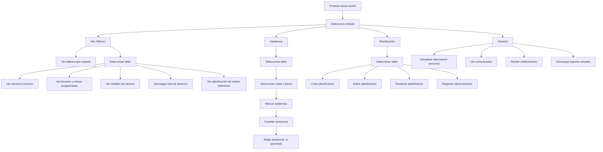
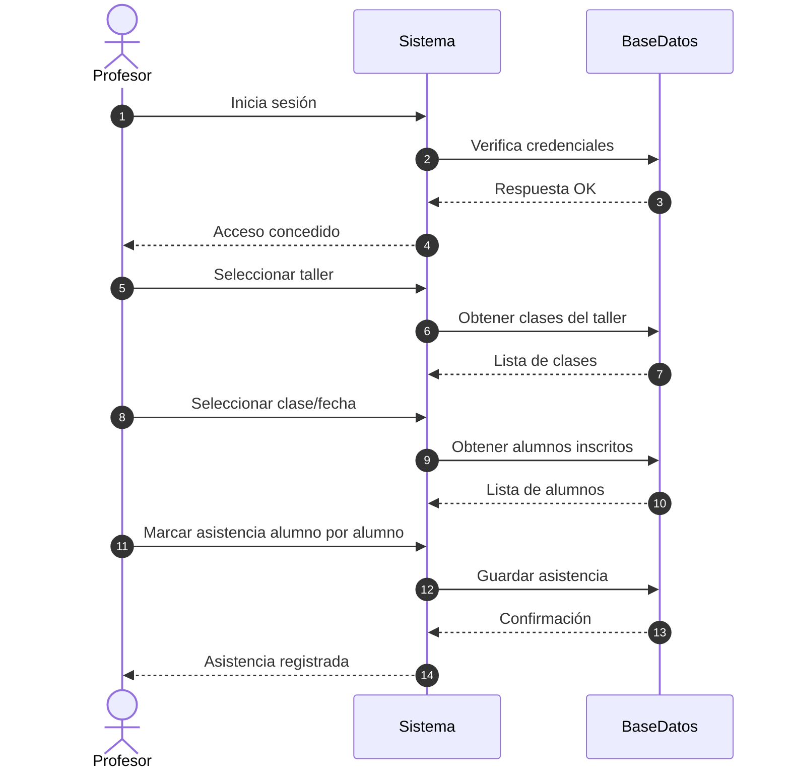
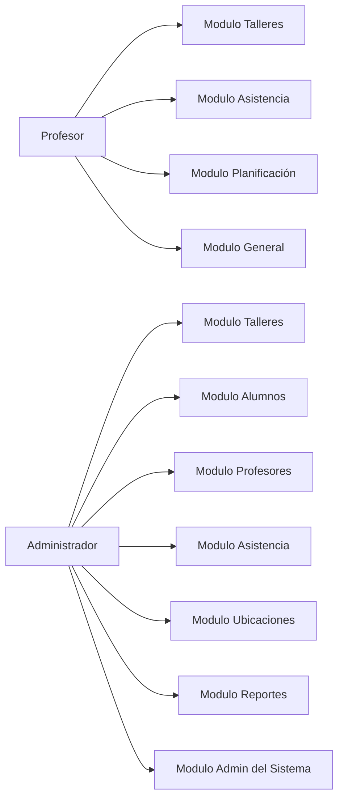
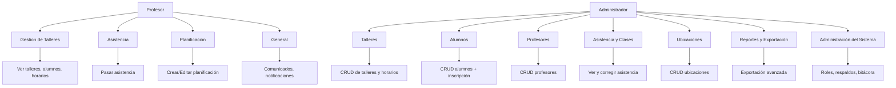

# Rol: Profesor

1\. Funciones relacionadas con sus talleres

* Ver talleres que imparte.
* Ver el listado de alumnos inscritos en sus talleres.
* Ver los horarios del taller y sus clases programadas.
* Ver el detalle de los alumnos: contacto, edad, etc.
* Descargar lista de alumnos.
* Ver planificación de clases anteriores

2\. Funciones relacionadas con la asistencia

* Pasar asistencia por clase y fecha.
* Ver el registro histórico de asistencias de sus grupos.
* Editar asistencia pasada (si el administrador lo autoriza).

3\. Funciones relacionadas con la planificación

* Crear planificación de una clase (contenido, objetivos, ejercicios).
* Editar planificación de la clase.
* Ver planificaciones pasadas para reutilizarlas.
* Registrar notas u observaciones de la clase (avances, problemas, etc).

4\. Funciones generales

* _Actualizar su información personal._
* Recibir notificaciones de cambios en horarios o alumnos nuevos.
* Ver comunicados enviados por la administración.
* Descargar reportes simples de sus talleres (asistencia, alumnos).

# Rol: Administrador

1\. Funciones relacionadas con talleres

* Ver, crear, editar y eliminar talleres.
* Gestionar los horarios del taller (crear, modificar, pausar).
* Asignar profesores a cada horario.
* Ver la planificación de cada clase.
* Ver estadísticas de talleres (cupos, asistencia, alumnos inscritos).
* Pausar o archivar talleres.

2\. Funciones relacionadas con alumnos

* Ver, crear, editar y eliminar alumnos.
* Inscribir o desinscribir alumnos de talleres.
* Ver en qué talleres participa cada alumno.
* Ver historial de asistencias del alumno.
* Importar alumnos desde plantilla Excel/CSV.

3\. Funciones relacionadas con profesores

* Ver, crear, editar y eliminar profesores.
* Asignar talleres y horarios.
* Ver carga semanal del profesor (horas totales).
* Deshabilitar profesores (sin eliminarlos) si se van de la oficina.

4\. Funciones relacionadas con asistencia y clases

* Ver asistencias de cualquier taller o clase.
* Corregir asistencias en caso de errores.
* Generar reportes de asistencia por taller, profesor o fecha.
* Consultar detalle de clase planificada por cada profesor.

5\. Funciones relacionadas con ubicaciones

* Crear, editar o eliminar ubicaciones/espacios deportivos.
* Asignar horarios a una ubicación.
* Ver disponibilidad de espacios.

6\. Funciones relacionadas con reportes y exportación

* Filtrar y generar reportes avanzados por:
    *   taller
    *   profesor
    *   alumno
    *   rango de fechas
    *   asistencia
    *   nivel, género, edad, etc.

* Exportar datos en formatos:
    *   Excel
    *   CSV
    *   PDF

* Exportar listas de alumnos por taller.
* Exportar planificaciones y asistencia mensual.

7\. Funciones administrativas generales

* Administrar usuarios del sistema (roles, permisos).
* Ver bitácora de cambios (opcional).
* Publicar avisos o comunicados para profesores.
* Configurar año académico / periodos.
* Respaldos de la base de datos (si lo incluyes en tu sistema).

---

Extras opcionales según necesidades del municipio

* Marcar alumnos con observaciones (lesiones, rendimiento, comportamiento).

---

Perfecto. Aquí te entrego **TODOS los tipos de diagramas**, cada uno completamente funcional en **Mermaid**, sin errores y listo para pegar en mermaid.live.

Incluye:

1. 🟦 **Diagrama de flujo del Profesor**
2. 🟧 **Diagrama de flujo del Administrador**
3. 🟩 **Diagrama UML de casos de uso (por rol)**
4. 🟪 **Diagrama de secuencia (ejemplo: Profesor pasa asistencia)**
5. 🟨 **Diagrama por módulos (compacto y muy útil para documentación)**
6. 🟥 **Diagrama combinado (Profesor + Administrador en uno solo)**

Si necesitas los archivos en PDF o Word, también te los genero.

---

## 🟦 **1. DIAGRAMA DE FLUJO — PROFESOR**

---

## 🟧 **2. DIAGRAMA DE FLUJO — ADMINISTRADOR**

```mermaid
flowchart TD

    A[Administrador inicia sesión] --> B[Selecciona módulo]

    B --> T[Talleres]
    B --> AL[Alumnos]
    B --> PR[Profesores]
    B --> AC[Asistencia y Clases]
    B --> UB[Ubicaciones]
    B --> RP[Reportes]
    B --> AD[Administración]

    %% Talleres
    T --> T1[Crear taller]
    T --> T2[Editar taller]
    T --> T3[Eliminar taller]
    T --> T4[Pausar o archivar taller]
    T --> T5[Gestionar horarios]
    T5 --> T6[Asignar profesor a horario]
    T --> T7[Ver planificación de clases]
    T --> T8[Ver estadísticas de talleres]

    %% Alumnos
    AL --> A1[Crear alumno]
    AL --> A2[Editar alumno]
    AL --> A3[Eliminar alumno]
    AL --> A4[Inscribir en taller]
    AL --> A5[Desinscribir de taller]
    AL --> A6[Ver talleres del alumno]
    AL --> A7[Ver historial de asistencia]
    AL --> A8[Importar alumnos desde Excel/CSV]

    %% Profesores
    PR --> P1[Crear profesor]
    PR --> P2[Editar profesor]
    PR --> P3[Eliminar profesor]
    PR --> P4[Deshabilitar profesor]
    PR --> P5[Asignar talleres y horarios]
    PR --> P6[Ver carga semanal del profesor]

    %% Asistencia
    AC --> C1[Ver asistencias]
    AC --> C2[Corregir asistencias]
    AC --> C3[Generar reportes de asistencia]
    AC --> C4[Ver planificación de clases]

    %% Ubicaciones
    UB --> U1[Crear ubicación]
    UB --> U2[Editar ubicación]
    UB --> U3[Eliminar ubicación]
    UB --> U4[Asignar horarios a ubicación]
    UB --> U5[Ver disponibilidad de espacios]

    %% Reportes
    RP --> R1[Filtrar reportes avanzados]
    RP --> R2[Exportar Excel]
    RP --> R3[Exportar CSV]
    RP --> R4[Exportar PDF]
    RP --> R5[Exportar listas de alumnos]
    RP --> R6[Exportar asistencia mensual]
    RP --> R7[Exportar planificaciones]

    %% Administración
    AD --> D1[Administrar usuarios y roles]
    AD --> D2[Ver bitácora de cambios]
    AD --> D3[Publicar comunicados]
    AD --> D4[Configurar periodos]
    AD --> D5[Respaldos de base de datos]
```

---

## 🟩 **3. DIAGRAMA UML — Casos de uso**

```mermaid
flowchart LR

    %% Actores
    P((Profesor))
    A((Administrador))

    %% Profesor casos
    subgraph Profesor_UseCases[Casos de uso del Profesor]
        UC1((Ver talleres))
        UC2((Ver alumnos del taller))
        UC3((Pasar asistencia))
        UC4((Editar asistencia))
        UC5((Crear planificación))
        UC6((Editar planificación))
        UC7((Ver planificaciones antiguas))
        UC8((Registrar observaciones))
        UC9((Ver comunicados))
        UC10((Descargar reportes simples))
    end

    %% Admin casos
    subgraph Admin_UseCases[Casos de uso del Administrador]
        AC1((Crear talleres))
        AC2((Editar talleres))
        AC3((Eliminar talleres))
        AC4((Gestionar horarios))
        AC5((Asignar profesor))
        AC6((Gestionar alumnos))
        AC7((Gestionar profesores))
        AC8((Corregir asistencias))
        AC9((Exportar datos))
        AC10((Administrar roles))
        AC11((Publicar comunicados))
        AC12((Gestion de ubicaciones))
        AC13((Ver reportes avanzados))
        AC14((Respaldos del sistema))
    end

    %% Relaciones profesor
    P --> UC1
    P --> UC2
    P --> UC3
    P --> UC4
    P --> UC5
    P --> UC6
    P --> UC7
    P --> UC8
    P --> UC9
    P --> UC10

    %% Relaciones admin
    A --> AC1
    A --> AC2
    A --> AC3
    A --> AC4
    A --> AC5
    A --> AC6
    A --> AC7
    A --> AC8
    A --> AC9
    A --> AC10
    A --> AC11
    A --> AC12
    A --> AC13
    A --> AC14
```

---

## 🟪 **4. DIAGRAMA DE SECUENCIA — Ejemplo: Profesor pasa asistencia**

---

## 🟨 **5. DIAGRAMA POR MÓDULOS**

---

## 🟥 **6. DIAGRAMA COMBINADO — Profesor + Administrador (todo en uno)**

